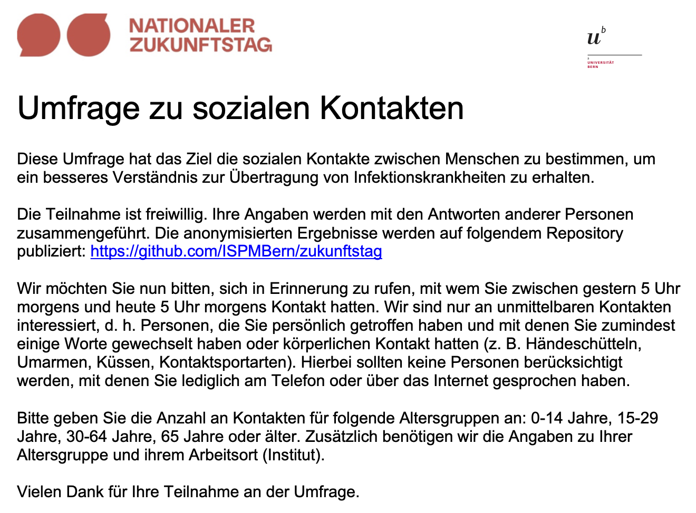
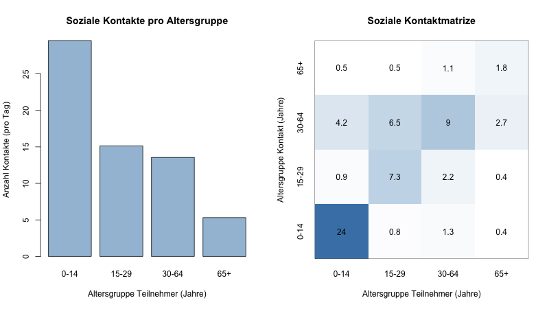

# Zukunftstag - Umfrage zu sozialen Kontakten

Am [Nationalen Zukunftstag](https://www.nationalerzukunftstag.ch) vom 9. November 2023 führten zwei Sechstklässlerinnen im Universitätsgebäude an der Mittelstrasse 43 eine Umfrage zu sozialen Kontakten durch.

**Abbildung 1. Informations-Flyer zur Umfrage zu sozialen Kontakten.**

Aus den Daten von 50 Studienteilnehmer*innen konnten wir für die Altersgruppen von 0-14 Jahre, 15-29 Jahre, 30-64 Jahre und 65 Jahre oder älter folgende Kontaktraten berechnen:

**Abbildung 2. Durchschnittliche Anzahl Kontakte pro Altersgruppe und soziale Kontaktmatrize.** Da wir keine Studienteilnehmer*innen hatten, welche 65 Jahre oder älter sind, basieren die Kontaktraten für die älteste Altersgruppe auf der Studie von [Prem et al. (2021)](https://doi.org/10.1371/journal.pcbi.1009098).

## Daten
Die Kontaktmatrize kann hier runtergeladen werden: [contact_matrix.csv](data/processed/contact_matrix.csv)

## Studien-Team
- Sofia Althaus
- Flora Reichel
